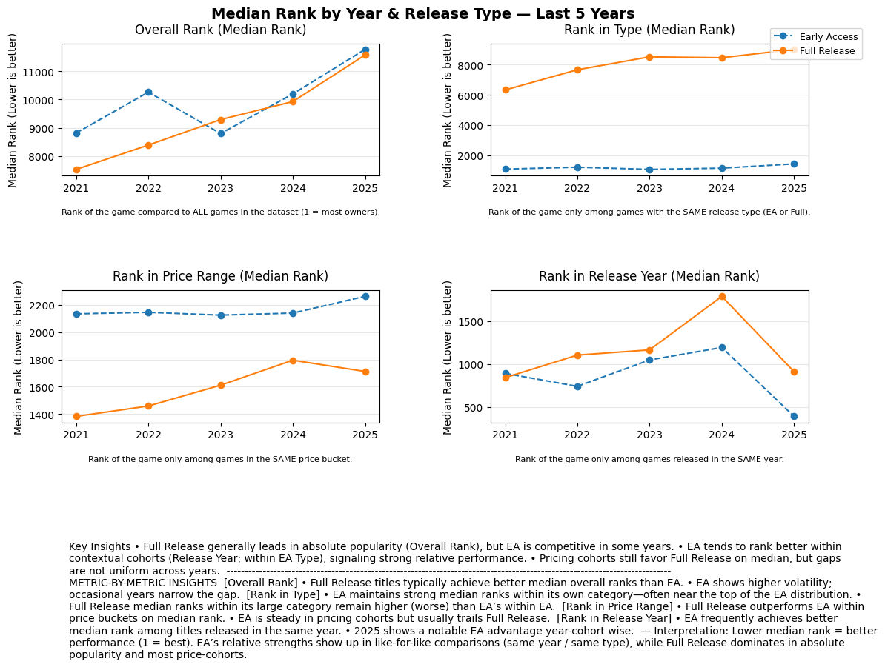
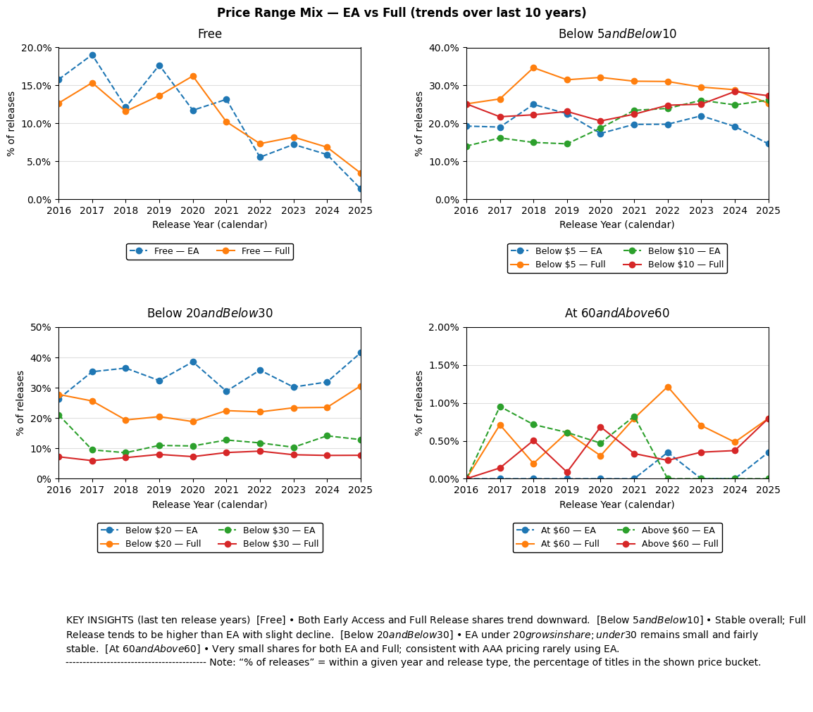

# 👋 About Me

Hi, I’m **Alec Bravo** — a Business Systems Analyst with 6+ years of experience designing scalable processes, integrating systems, and building data-driven solutions for global teams. My expertise spans **SQL, Python, ETL pipelines, Redshift, Salesforce, Power BI, and process mapping**, with a proven track record of automating workflows, improving data quality, and delivering actionable insights.

I thrive at the intersection of business and technology, translating complex requirements into efficient, maintainable systems. From developing global dashboards tracking $5B+ in opportunities to launching automation tools that save thousands of manual hours annually, I focus on creating solutions that make a measurable impact.

Beyond the professional world, I’m passionate about **traveling with my girlfriend**, spending time with my **Labrador Retriever named Bilbo**, and exploring immersive **RPGs and MMOs** as a gamer. My curiosity and creativity drive both my personal and professional life — whether I’m building analytical tools or leveling up in a virtual world.

  
  

---

# Game Market Analysis (EA vs Full Release)

Alec Bravo — SQL • Python • DuckDB • Matplotlib • Plotly • VS Code

---

## Process Map

## Overview
Goal: Understand how Early Access compares to Full Releases in popularity and pricing trends, and which developers and price buckets drive owners.

## Key Findings
- Full Releases win on absolute popularity; EA performs strongly in year- and type-normalized ranks.
- Pricing share shows growth of EA under \$20; \$60+ is niche for both.
- Sankey reveals top developers flow mostly to Full Release and higher price tiers.

## Charts
- **Plot A — Median Rank bump charts (last 5 years):**  
  

- **Plot B — Price Range Mix (last 10 years):**  
  

- **Plot C — Interactive Sankey (Top Dev → Release Type → Price Range):**  
  👉 [Open interactive Sankey](Sankey Top 10 Developers last 5 years.png)

## Methods & Code
- **SQL:** price bucketing, EA join, rank windows (`ROW_NUMBER`), date parsing.
- **Python:** DuckDB query → pandas shaping → robust plotting with Matplotlib/Plotly.
- [SQL script](../sql/analysis.sql) • [Notebook/Script](../notebooks/analysis.py)

## About & Resume
- [Resume (PDF)](assets/resume.pdf)
- Contact: you@domain.com • LinkedIn: https://linkedin.com/in/yourname
