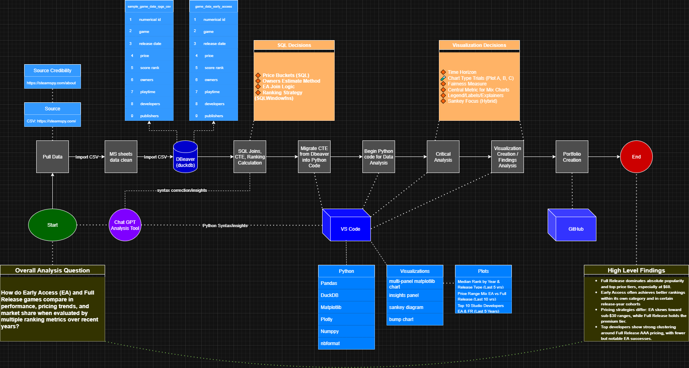
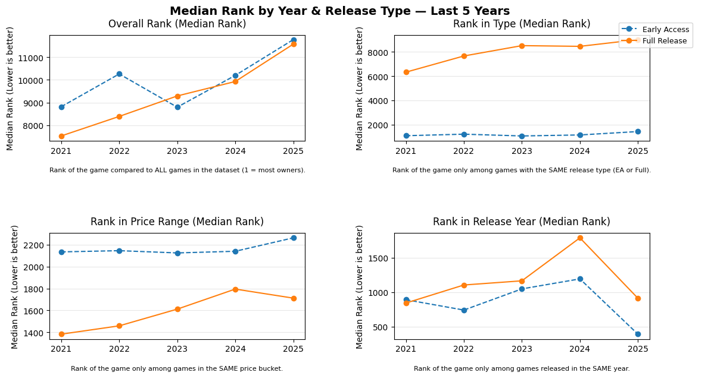
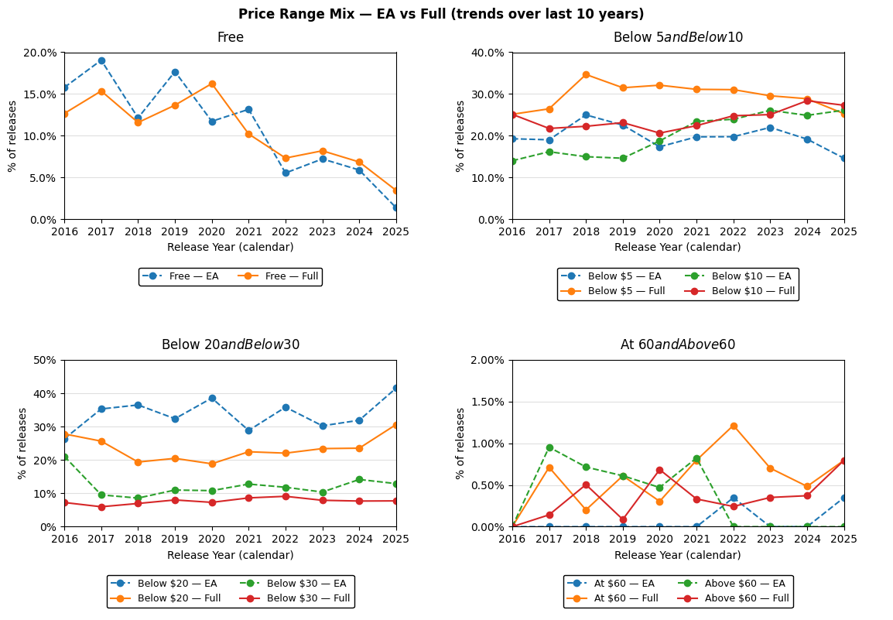
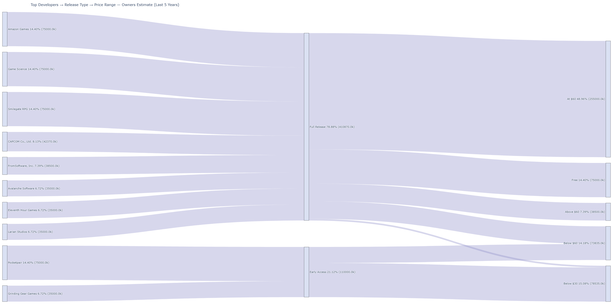

# Biography 🧙

  

Hello, my name is Alec Bravo and I’ve spent the last 6+ years bridging the gap between business and technology. I’ve designed scalable processes, integrated systems, and built data-driven solutions for global teams using **SQL, Python, ETL pipelines, Redshift, Salesforce, Power BI, and process mapping.**  

From developing global dashboards tracking $5B+ in opportunities to launching automation tools that save thousands of manual hours annually, I have a proven track record of automating workflows, improving data quality, and delivering actionable insights.

Beyond my career, my adventures include traveling with my girlfriend, spending time with my 10 week old Labrador puppy named Bilbo, and exploring immersive RPGs and MMOs. Whether in the real world or virtual realms, I’m on the quest to conquer the next challenge. 

  <figure style="display:inline-block; margin: 10px;">
    
    <figcaption><i>Bilbo — 10 Weeks Old</i></figcaption>
  </figure>
  <figure style="display:inline-block; margin: 10px;">
    
    <figcaption><i>Kyoto Japan</i></figcaption>
  </figure>

---

###  Start Here: How to Explore
1. Read my **Process Map** to see the analysis flow.
2. Review **Key Findings** to digest the story.
3. Scroll through the **Charts** to explore the data.
4. Dive into **Methods & Code** if you'd like to replicate my work.

# Game Market Insights: Early Access vs Full Release Performance

## 🛠 Tools & Technologies

---

## Process Map

## Overview

Goal: Understand how Early Access compares to Full Releases in popularity and pricing trends, and which developers and price buckets drive owners.

## **Key Findings**

---

### **1. Popularity & Performance Trends** — *Plot A: Median Rank by Year & Release Type (Last 5 Years)*  

- **Full Release (FR)** titles consistently maintain better median overall ranks (lower = more owners) across the 5-year window.  
- **Early Access (EA)** often achieves higher relative performance within its own category and in certain release-year cohorts (notably in 2025).  
- EA rankings fluctuate more year-to-year, indicating higher volatility; FR is steadier.  
- *Takeaway:* EA can match or exceed FR when compared by similar release type/year, but struggles to surpass in absolute popularity.

---

### **2. Pricing Distribution Over Time** — *Plot B: Price Range Mix (Last 10 Years)*  

- **Free Games:** Long-term decline for both EA and FR; FR slightly ahead until recent years.  
- **Below $5 & Below $10:** FR stable, EA shows slow growth.  
- **Below $20 & Below $30:** EA holds a larger share under $20, showing a budget-focused entry strategy.  
- **At $60 & Above:** Rare for EA; FR dominates premium pricing, especially at $60 (nearly half the market share in that bucket).  
- *Takeaway:* EA leverages low prices to attract players, while FR focuses on premium positioning.

---

### **3. Developer & Market Flow** — *Plot C: Sankey (Top 10 Developers, Last 5 Years)*  

- **78.88%** of all owners from the top 10 developers come from FR titles.  
- FR from top devs is heavily weighted toward premium tiers ($60).  
- EA titles cluster under $30, with some notable high-owner exceptions.  
- AAA studios dominate FR high-price tiers, while smaller/niche studios often succeed in EA.  
- *Takeaway:* Premium tiers remain the domain of established AAA studios, while EA enables growth for emerging developers.

---

### **4. Strategic Insights**
- EA’s strongest results appear in relative comparisons (same year/type), while FR leads in absolute market terms.  
- Pricing is a key differentiator: EA = affordability; FR = premium brand strength.  
- Developer concentration reinforces market segmentation: AAA controls premium tiers; EA offers lower-barrier entry.

> **Data Caveat:**  
> This dataset reflects the market **at the time of extraction**. It does not account for successful titles that transitioned from EA to Full Release afterward, such as *Baldur’s Gate 3*. Inclusion of these could shift the metrics.

---

## Methods & Code
- **SQL:** price bucketing, EA join, rank windows (`ROW_NUMBER`), date parsing.
- **Python:** DuckDB query → pandas shaping → robust plotting with Matplotlib/Plotly.
- [SQL script](game_data_project_sqlcode.sql) • [Notebook/Script](analyze_game_view_data.py)

---

## LinkedIn & Resume

## Last Updated August 2025
